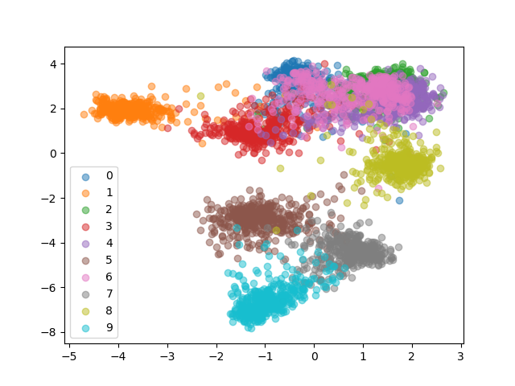

# metric_learning_siamese_online_triplet_loss

To tackle the problem with the vanilla "Triplet Loss", an "Online Triplet Loss" with "Batch All" and "Batch Hard" strategy was proposed in the paper "In Defense of Triplet Loss for Person Re-Identification". 

### Triplet Mining
Based on the definition of loss, there are three categories of triplets:  
#### 1) Easy Triplets:
Triplets which have a loss of 0 because for them d(a,p) + margin < d(a,n)  
#### 2) Semi Hard Triplets:
Triplets where the negative is not closer to the anchor than the positive, but which still have positive loss i.e., for them d(a,p) < d(a,n) < d(a,p) + margin  
#### 3) Hard Triplets:
Triplets where the negative is closer to the anchor than the positive i.e., for them d(a,n) < d(a,p)  

### Online Triplet Mining and "Batch All"/"Batch Hard" strategy
The idea here is to compute useful triplets on the fly, for each batch of inputs i.e., for a batch of images (i.e., B images) B embeddings are created and then using these B embeddings, triplets are generated on the fly.  

If three indices (i,j,k) are given then if (i) and (j) have the same label but images are distinct and (k) is a different label than (i) and (j) then (i,j,k) is a valid triplet. Now, the two strategies to compute loss using the valid triplets are as follows:  

Suppose you have a batch of B images such that B = PK where P is the class to which an image belongs and K are the number of images of p^th class i.e., for each of the P classes exactly K images need to be choosen.  

#### 1) batch_all strategy:
Select all the valid triplets, and average the loss on the hard and semi-hard triplets. A crucial point here is to not take into account the easy triplets (those with loss 0), as averaging on them would make the overall loss very small. 
This produces a total of PK(PK-K)(K-1) triplets or terms for computing the loss. 
#### 2) batch_hard strategy:
For each anchor, select the hardest positive (biggest distance d(a,p)) and the hardest negative among the batch.  
This produces PK triplets or terms for computing the loss and the selected triplets are the hardest among the batch.  

The results obtained using "batch_all strategy" on FMNIST dataset are as follows: 

On the FMNIST Train Set: 

On the FMNIST Test Set: 

